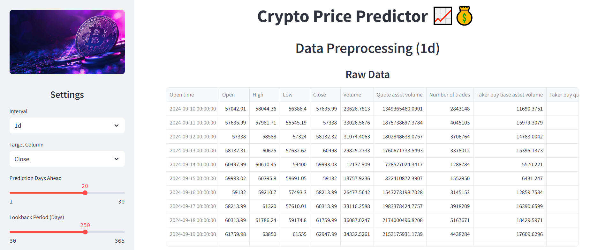
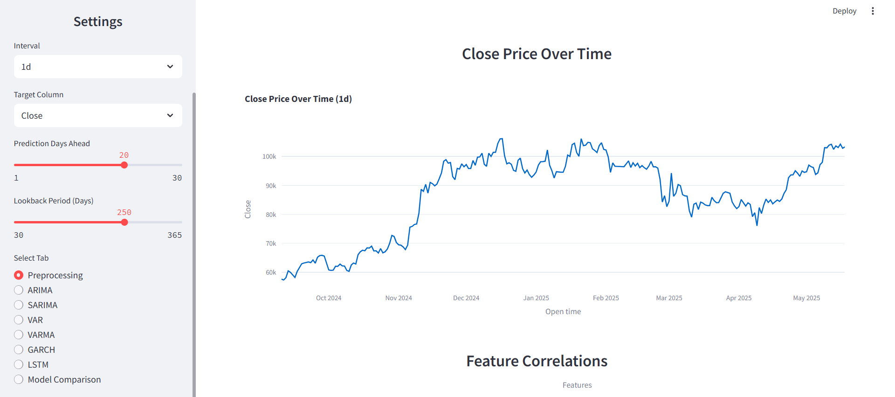
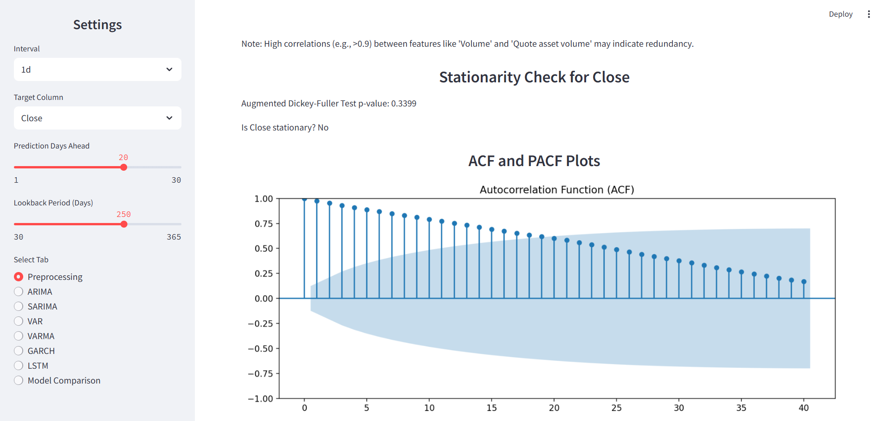
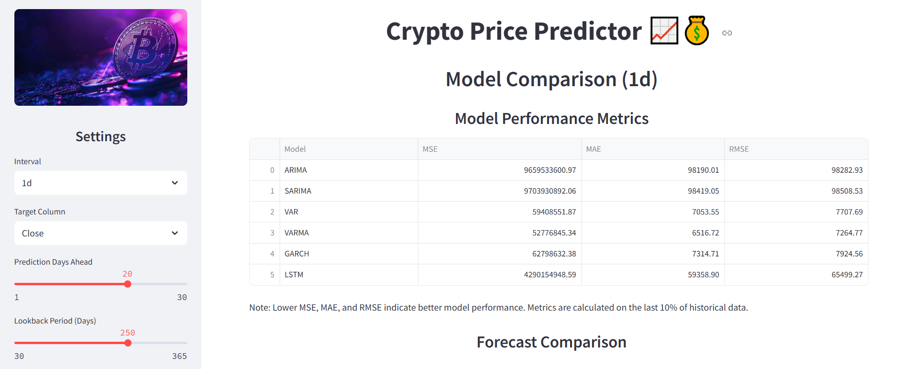
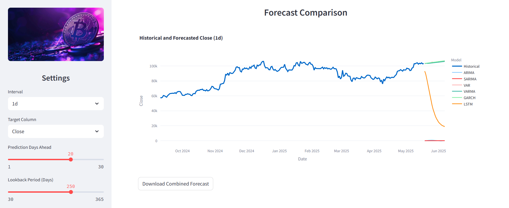

# Crypto Price Predictor 📈💰

Welcome to the **Crypto Price Predictor**, a web-based application built with Streamlit to forecast cryptocurrency prices using advanced time-series models. This project focuses on Bitcoin (BTC) price prediction across multiple time intervals (15m, 1h, 4h, 1d) using models like ARIMA, SARIMA, VAR, VARMA, GARCH, and LSTM. Whether you're a data scientist, crypto enthusiast, or developer, this app provides an intuitive interface to explore historical data, generate forecasts, and evaluate model performance.

## 📸 UI Screenshots


---



---



---



---



## 🚀 Features

- **Multiple Models**: Leverage ARIMA, SARIMA, VAR, VARMA, GARCH, and LSTM for price forecasting.
- **Interactive Interface**: Built with Streamlit for a user-friendly experience.
- **Customizable Settings**: Choose intervals (15m, 1h, 4h, 1d), target columns (e.g., Close, Volume), prediction horizons, and lookback periods.
- **Visualization**: Plot historical data and forecasts using Plotly.
- **Model Evaluation**: Compute metrics like MSE, MAE, and RMSE for test data.
- **Downloadable Forecasts**: Export predictions as CSV files.

## 📋 Prerequisites

Before running the project, ensure you have the following:

- **Python 3.8+** 🐍
- A virtual environment (recommended)
- Required Python packages (listed in `requirements.txt`)
- CSV data files for BTC prices (e.g., `data/btc_1d_data_2018_to_2025.csv`)

## 🛠️ Installation

1. **Clone the Repository**  
   If the project is hosted on a Git repository, clone it. Otherwise, navigate to the project directory:
   ```bash
   cd F:\Study\Applied_ML\crypto_app
   ```

2. **Set Up a Virtual Environment**  
   Create and activate a virtual environment to manage dependencies:
   ```bash
   python -m venv venv
   .\venv\Scripts\activate  # Windows
   # source venv/bin/activate  # Linux/Mac
   ```

3. **Install Dependencies**  
   Install the required Python packages:
   ```bash
   pip install -r requirements.txt
   ```
   If `requirements.txt` is not present, install the following:
   ```bash
   pip install streamlit pandas numpy statsmodels arch tensorflow scikit-learn joblib plotly
   ```

4. **Prepare Data Files**  
   Ensure the following CSV files are in the `data/` directory:
   - `btc_15m_data_2018_to_2025.csv`
   - `btc_1h_data_2018_to_2025.csv`
   - `btc_4h_data_2018_to_2025.csv`
   - `btc_1d_data_2018_to_2025.csv`  
   Each file should have columns: `Open time`, `Open`, `High`, `Low`, `Close`, `Volume`, etc.

   You can get the data from [here](https://www.kaggle.com/datasets/novandraanugrah/bitcoin-historical-datasets-2018-2024)

5. **Train Models**  
   Run the training script to generate models for each interval:
   ```bash
   python backend/train_models.py
   ```
   This creates model files in `backend/models/{interval}/` (e.g., `arima_model_1d.pkl`).

## ▶️ Usage

1. **Run the Application**  
   Start the Streamlit app:
   ```bash
   streamlit run app.py
   ```
   Open the provided URL (e.g., `http://localhost:8501`) in your browser.

2. **Explore the App**  
   - **Sidebar Settings** ⚙️:
     - Select an interval (15m, 1h, 4h, 1d).
     - Choose a target column (e.g., Close).
     - Set prediction days ahead (1–30).
     - Adjust the lookback period (30–365 days).
   - **Tabs** 📑:
     - **Preprocessing**: View data statistics and stationarity.
     - **ARIMA/SARIMA/VAR/VARMA/GARCH/LSTM**: Generate forecasts and evaluate models.
     - **Model Comparison**: Compare forecasts across models (if implemented).

3. **Interact with Forecasts**  
   - Click "Predict with [Model]" to generate forecasts.
   - View historical and forecasted prices in interactive plots.
   - Download forecasts as CSV files.

## 📂 Project Structure

Below is the file structure of the project:

```
crypto_price_forecasting/
│
├── app.py
├── requirements.txt
│
├── backend/
│   ├── models/
│   ├── predictor.py
│   ├── train_models.py
│   └── data_utils.py
│
├── data/
│   ├── btc_15m_data_2018_to_2025.csv
│   ├── btc_1h_data_2018_to_2025.csv
│   ├── btc_4h_data_2018_to_2025.csv
│   └── btc_1d_data_2018_to_2025.csv
│
├── frontend/
│   ├── images/
│   │   └── crypto_logo.png
│   ├── styles/
│   │   └── streamlit_style.css
│   └── tabs/
│       ├── arima_forecast.py
│       ├── garch_forecast.py
│       ├── lstm_forecast.py
│       ├── model_comparison.py
│       ├── preprocessing.py
│       ├── sarima_forecast.py
│       ├── var_forecast.py
│       └── varma_forecast.py
│
└── README.md
```

## ⚠️ Troubleshooting

- **ModuleNotFoundError**: Ensure all dependencies are installed (`pip install -r requirements.txt`).
- **Data Interval Mismatch**: Verify that CSV timestamps match the selected interval (e.g., hourly for 1h).
- **Model Not Loaded**: Run `train_models.py` to generate model files in `backend/models/`.

## 🤝 Contributing

Contributions are welcome! To contribute:
1. Fork the repository (if hosted on Git).
2. Create a feature branch (`git checkout -b feature-name`).
3. Commit your changes (`git commit -m "Add feature"`).
4. Push to the branch (`git push origin feature-name`).
5. Open a pull request.

Please ensure your code follows PEP 8 style guidelines and includes appropriate tests.

## 📜 License

This project is licensed under the MIT License.
